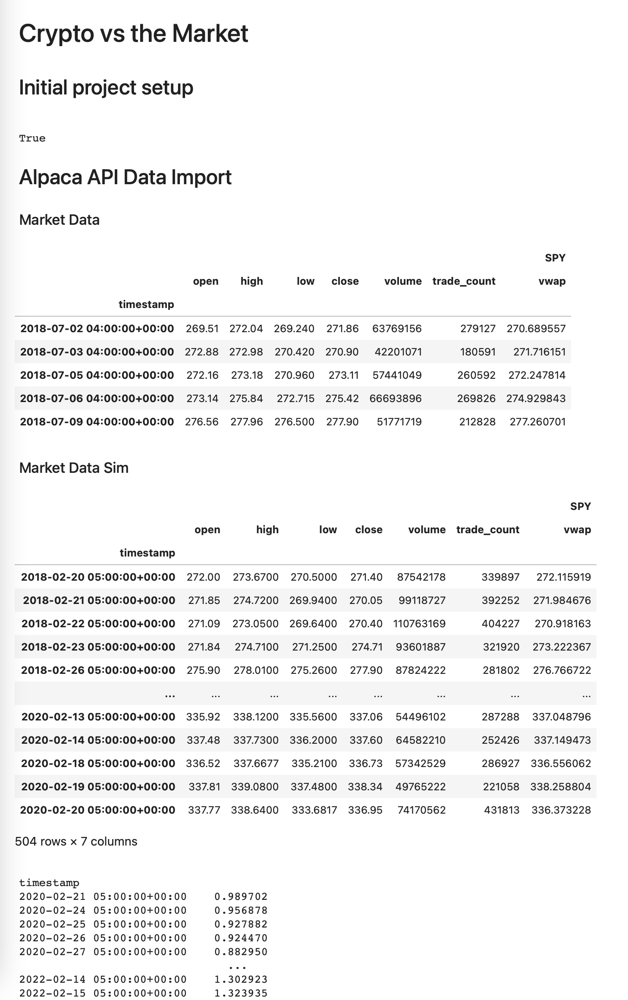

# Crypto vs the Market

This project is a comprehensive analysis of Bitcoin and the S&P 500. The purpose of this project is to identify which of these two assets would be the most profitable to invest in. This is determined by analyzing the returns of holding the asset long-term, trading the asset over the same time period using a basic EMA strategy, and analyzing Monte Carlo Simulations to identify possible future movement.

---

## Technologies

This project leverages python with the following packages:

* [Pandas](https://github.com/pandas-dev/pandas) - For plotting and dataframes.

* [Pandas TA](https://github.com/twopirllc/pandas-ta) - For indicators.

* [PyViz](https://github.com/pyviz/pyviz.org) - For plotting with hvplot.

* [dotenv](https://pypi.org/project/python-dotenv/) - For accessing the .env file.

* [Voila](https://github.com/voila-dashboards/voila) - For web deployment.

* [Alpaca Trade API](https://github.com/alpacahq/alpaca-trade-api-python) - For financial data from [Alpaca](https://alpaca.markets)

* MCForecastTools - For Monte Carlo simulations. For documentation, use ?MCSimulation

---

## Installation Guide

Before first running the application install the following dependencies:

```python
    pip install pandas
    pip install pandas_ta
    pip install python-dotenv
    pip install alpaca-trade-api
    pip install voila
```

Login to Conda `Dev` environment and install the following dependencies:

```python
    conda install -c pyviz hvplot
```

Jupyter may be required to view the .ipynb file.

```python
    pip install jupyter
```

This application also utilizes a .env file in order to store API keys and secret keys for the Alpaca API & SDK. In order to use this, you must create a .env file and set it up like the following:

```
ALPACA_API_KEY = "<Your API Key Here>"
ALPACA_SECRET_KEY = "<Your Secret Key Here>"
```

The MCForecastTools.py included contains everything needed for the Monte Carlo simulations.

---

## Usage

To use Voila, type the following into the terminal while in the cloned project repository.

```python
voila crypto-vs-the-market.ipynb
```

This will deploy the notebook as an interactive web app like the example pictured below.



---

## Contributors

Brought to you by:
* [Majid](https://github.com/MajidKouki)
* [Dan](https://github.com/dandmcqueen)
* [Jason](https://github.com/jasonbucks)
* [Tracy](https://github.com/emorytk)

---

## License

MIT